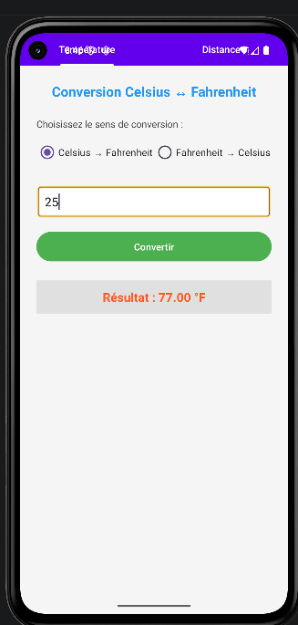

# ConverterTabsJava

Une application Android de conversion double avec interface à onglets, développée en Java.

## 📱 Description

ConverterTabsJava est une application mobile Android permettant d'effectuer des conversions dans deux catégories principales :

- **Température** : Conversion entre Celsius (°C) et Fahrenheit (°F)
- **Distance** : Conversion entre Kilomètres (Km) et Miles

L'application dispose d'une interface moderne avec onglets, d'un menu de navigation et d'une confirmation de sortie.

## ✨ Fonctionnalités

### 🎯 Fonctionnalités principales
- ✅ Interface à deux onglets (Température / Distance)
- ✅ Conversion temps réel
- ✅ Validation des saisies utilisateur
- ✅ Messages d'erreur (champs vides, valeurs invalides)
- ✅ Résultats formatés avec 2 décimales
- ✅ Menu "Quitter" dans la barre d'action
- ✅ Confirmation avant fermeture (bouton retour)

### 🌡️ Conversion Température
- Celsius → Fahrenheit : `(température × 9/5) + 32`
- Fahrenheit → Celsius : `(température - 32) × 5/9`

### 📏 Conversion Distance
- Kilomètres → Miles : `distance × 0.621371`
- Miles → Kilomètres : `distance ÷ 0.621371`

## 📋 Prérequis

- **Android Studio** : Hedgehog | 2023.1.1 ou supérieur
- **SDK Android** : API 24 (Android 7.0) minimum
- **Langage** : Java 11
- **Gradle** : 8.2.0 ou supérieur

## 🛠️ Technologies utilisées

| Technologie | Version | Utilité |
|------------|---------|---------|
| Java | 11 | Langage de programmation |
| Android SDK | API 24+ | Plateforme Android |
| Material Design | 1.12.0 | Composants UI modernes |
| ViewPager2 | 1.0.0 | Navigation par onglets |
| TabLayout | 1.12.0 | Barre d'onglets |

### screenshots

